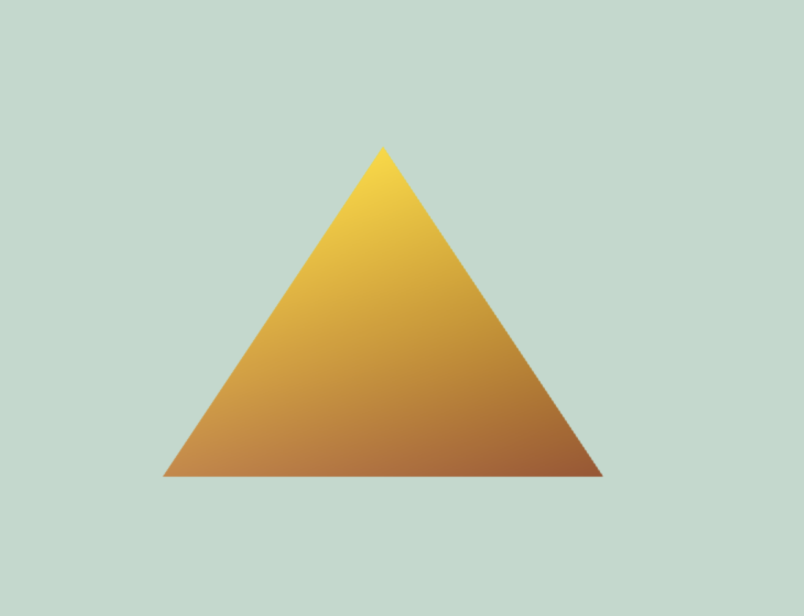

# webgl-pyramid
Intro WebGL project demonstrating vertex and fragment shaders to render a colored triangle on a canvas.

# WebGL Shader Demo

This project is a demonstration of using WebGL to render a colored triangle on a canvas. The project includes vertex and fragment shaders to process and display graphics directly in the browser.

# WebGL Shader Demo

This project is a demonstration of using WebGL to render a colored triangle on a canvas. The project includes vertex and fragment shaders to process and display graphics directly in the browser.

## Features

- **Vertex Shader**: Processes vertex positions and passes color information.
- **Fragment Shader**: Colors each pixel based on interpolated vertex colors.
- **Interactive Graphics**: Renders a triangle with vertices of different colors, showcasing smooth color transitions.

## Technologies Used

- **HTML5**: For the canvas element.
- **JavaScript**: To set up and run WebGL.
- **WebGL**: For rendering graphics.

## How It Works

1. **Vertex Shader**: The vertex shader processes each vertex of the triangle, setting its position and passing its color to the fragment shader.
2. **Fragment Shader**: The fragment shader receives interpolated colors from the vertex shader and sets the color for each pixel.
3. **WebGL Context**: Initializes the WebGL context and sets up the necessary buffers and shaders.

## Demo

Check out the live demo [here]([https://your-username.github.io/webgl-shader-demo](https://ezequielcutin.github.io/webgl-pyramid/)).

## Screenshots

